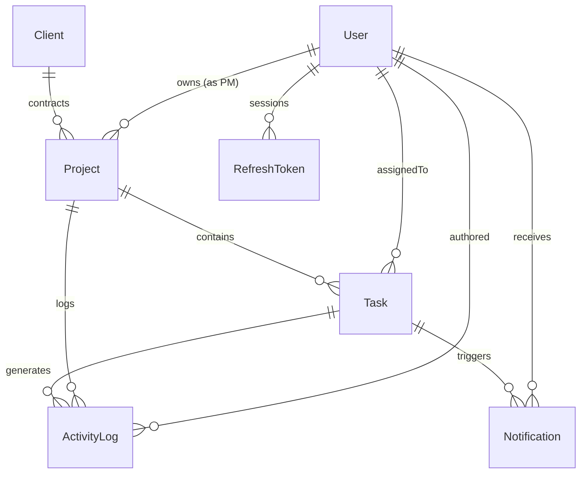

# projectManagement
## Real-Time Client Project Dashboard with Role-Based Access & Live Activity Feed

An enterprise-grade full-stack platform built for internal client project management, featuring real-time WebSocket activity feeds, strict role-based access control (RBAC), automated overdue task background scheduling, and live presence tracking.

---

### 🌐 Submission & Deployment Links
- **Public GitHub Repository**: [https://github.com/RahUlkr23r/projectManagement](https://github.com/RahUlkr23r/projectManagement)
- **Live Backend API & WebSockets (Render)**: [https://projectmanagement-1-srz9.onrender.com](https://projectmanagement-1-srz9.onrender.com)
- **API Health Check**: [https://projectmanagement-1-srz9.onrender.com/api/health](https://projectmanagement-1-srz9.onrender.com/api/health)
- **Live Frontend Application (Vercel)**: *Deployed via Vercel (connected to `client/` root)*

---

## 1. Quick Start / Local Setup Instructions

### Option A: Automated Local Setup (Recommended)
This repository includes a native embedded PostgreSQL cluster runner so you can spin up the full stack without needing any local PostgreSQL or Docker setup installed.

1. **Clone & Install Dependencies**:
   ```bash
   # From root:
   npm install
   cd server && npm install
   cd ../client && npm install
   cd ..
   ```

2. **Start Local PostgreSQL Cluster**:
   ```bash
   npm run db:local --prefix server
   ```
   *Spawns a native PostgreSQL 18 cluster on `localhost:5433` (persisted in `./pgdata/native-db`).*

3. **Initialize Database & Seed Data**:
   ```bash
   npm run prisma:generate --prefix server
   npm run prisma:migrate --prefix server   # or: npx prisma db push --skip-generate
   npm run prisma:seed --prefix server
   ```

4. **Launch Application (Server + Client)**:
   ```bash
   # From root directory:
   npm run dev
   ```
   - **Frontend Dashboard**: [http://localhost:5173](http://localhost:5173)
   - **Backend API & WebSockets**: [http://localhost:5000](http://localhost:5000)
   - **API Health Check**: [http://localhost:5000/api/health](http://localhost:5000/api/health)

---

### Option B: Docker Compose
```bash
docker-compose up --build
```
This orchestrates the PostgreSQL 16 Alpine container, Node.js server container, and Vite React client container.

---

## 2. Seed Credentials & Role Accounts

All accounts share the default development password: **`Password123!`**

| Name | Role | Email | Permissions Scope |
| :--- | :--- | :--- | :--- |
| **Sarah Admin** | `ADMIN` | `admin@velozity.com` | Global access: manage all clients, projects, users, global activity feed, live user presence |
| **Priya Sharma** | `PROJECT_MANAGER` | `pm1@velozity.com` | Owns 2 projects: creates/manages projects, assigns tasks, team activity feed only |
| **David Miller** | `PROJECT_MANAGER` | `pm2@velozity.com` | Owns 1 project: isolated from Priya's projects |
| **Ravi Kumar** | `DEVELOPER` | `dev1@velozity.com` | Assigned tasks only: updates status, dev-scoped feed |
| **Anita Patel** | `DEVELOPER` | `dev2@velozity.com` | Assigned tasks only |
| **Carlos Mendez** | `DEVELOPER` | `dev3@velozity.com` | Assigned tasks only |
| **Emily Chen** | `DEVELOPER` | `dev4@velozity.com` | Assigned tasks only |

*(Note: The login page includes 1-click quick login buttons for all these roles for instantaneous demonstration).*

---

## 3. Database Schema & Indexing Strategy

### Relational Schema Diagram (Entity-Relationship)


### Database Tables & Key Fields
1. **`users`**: `id (UUID)`, `email (unique)`, `passwordHash`, `name`, `role (ADMIN, PROJECT_MANAGER, DEVELOPER)`
2. **`clients`**: `id (UUID)`, `name`, `email (unique)`, `company`
3. **`projects`**: `id (UUID)`, `name`, `description`, `clientId (FK)`, `ownerId (FK -> users)`
4. **`tasks`**: `id (UUID)`, `taskNumber (Auto-Inc)`, `title`, `description`, `status`, `priority`, `dueDate`, `isOverdue`, `projectId (FK)`, `assignedToId (FK -> users)`
5. **`activity_logs`**: `id (UUID)`, `taskId (FK)`, `projectId (FK)`, `userId (FK)`, `previousStatus`, `newStatus`, `message`, `createdAt`
6. **`notifications`**: `id (UUID)`, `userId (FK)`, `taskId (FK)`, `type`, `title`, `message`, `isRead`, `createdAt`
7. **`refresh_tokens`**: `id (UUID)`, `tokenHash (unique)`, `userId (FK)`, `expiresAt`, `revoked`

### Indexing Decisions & Rationale
- **`tasks(projectId)`**: Optimizes project-level task retrieval (`WHERE projectId = ?`).
- **`tasks(assignedToId)`**: Powers the Developer Dashboard query (`WHERE assignedToId = ?`).
- **`tasks(status, priority)`**: Accelerates high-volume multi-column filtering in task boards.
- **`tasks(dueDate, status, isOverdue)`**: Critical composite index enabling the overdue background job to quickly scan past-due incomplete tasks (`dueDate < NOW() AND status != 'DONE' AND isOverdue = false`) without doing a full table scan.
- **`activity_logs(projectId, createdAt DESC)` & `activity_logs(createdAt DESC)`**: Guarantees sub-millisecond retrieval of the recent 20 activity logs for missed-event catchup and project streams.
- **`notifications(userId, isRead)`**: Enables constant-time evaluation of unread notification badge counts.
- **`refresh_tokens(userId, revoked, expiresAt)`**: Speeds up token validation and rotation lookups.

---

## 4. Architectural Decisions & Justifications

### 4.1. WebSocket Library Choice: Native `ws` over Socket.io
- **Decision**: Implemented native `ws` with custom heartbeat and room/role dispatching.
- **Justification**:
  1. Socket.io bundles heavy client/server fallback logic including HTTP long-polling and HTTP multipart streaming. The assessment explicitly mandates *"WebSocket — no long-polling, no SSE"*.
  2. Native WebSockets adhere directly to RFC 6455 with minimal protocol overhead, zero client vendor lock-in, and direct integration with Node's native HTTP upgrade pipeline.
  3. Our custom `WebSocketManager` handles authenticated handshakes (via query token), room-free memory-safe role filtering, and heartbeat ping-pongs (`30s` interval).

### 4.2. Background Job Choice: `node-cron` over Bull Queue
- **Decision**: Utilized `node-cron` for the overdue task scanner.
- **Justification**:
  1. Bull requires an external Redis instance running in memory. Introducing a dedicated Redis cluster for a periodic task check introduces infrastructure complexity and hosting costs unnecessary for this scale.
  2. `node-cron` runs natively in the Node runtime, executes an indexed database update query every minute, and triggers notifications via the WebSocket manager with zero external dependencies.

### 4.3. Token Storage & Refresh Token Approach
- **Decision**: Dual-token architecture with in-memory Access Tokens (`15m` expiry) and cryptographic HttpOnly Cookie Refresh Tokens (`7d` expiry).
- **Justification**:
  1. Storing tokens in `localStorage` makes an application vulnerable to Cross-Site Scripting (XSS) credential exfiltration.
  2. The refresh token is stored in an `HttpOnly`, `SameSite=Lax`, `Secure` cookie that cannot be read by JavaScript.
  3. **Token Rotation**: Every time `/api/auth/refresh` is hit, the current refresh token is revoked in the database and a new cryptographically random token is generated. This detects and mitigates replay attacks.

---

## 5. Security & Permission Boundaries

1. **API-Level Role Guards**: Frontend UI hides buttons, but the backend strictly enforces permissions via `authorizeRoles('ADMIN', 'PROJECT_MANAGER')` and ownership checks (`project.ownerId === req.user.id`).
2. **PM Data Isolation**: Project Managers can only fetch and update projects they created. Hitting `/api/projects/:id` for another PM's project returns a `403 Forbidden` structured response.
3. **Developer Boundary**: Developers can only fetch and update tasks assigned to their user ID. Direct calls to `/api/projects` or `/api/tasks` will never expose other developers' assignments.
4. **Structured Error Handling**: All controllers delegate uncaught exceptions to `errorHandler.ts`. Stack traces are strictly stripped, returning consistent structured JSON envelopes:
   ```json
   {
     "success": false,
     "error": {
       "message": "Access denied. Role 'DEVELOPER' is not authorized to access this resource",
       "statusCode": 403,
       "details": null
     }
   }
   ```

---

## 6. Known Limitations

1. **Multi-Node WebSocket Scaling**: Because WebSockets run on a single Node server instance, deploying multiple container replicas behind a load balancer would require a Redis Pub/Sub adapter to sync activity broadcasts and presence counts across server instances.
2. **Single-Region SQLite/PG fallback**: For containerized cloud environments, the database connection should be pointed to a cloud PostgreSQL provider like Supabase or Neon.

---

## 7. Submission Explanation Field (150–250 Words)

> The hardest problem in this assessment was designing a resilient, role-filtered real-time event pipeline that guarantees strict data privacy while supporting offline event recovery. Rather than naively broadcasting all task mutations to every socket, I implemented an authorization-aware `WebSocketManager` in Node.js. When a task status transitions, the server atomically records the change in PostgreSQL, generates a human-readable `ActivityLog`, and inspects connected clients: Admins receive global events, Project Managers receive events strictly matching their owned project IDs, and Developers receive events exclusively for their assigned tasks. For users reconnecting after network drops, the application queries indexed PostgreSQL logs (`ActivityLog` ordered by `createdAt DESC`) to deliver the last 20 missed events rather than relying on volatile in-memory caches. One thing I would do differently in a multi-region production setting is decouple the real-time transport using a distributed message broker (such as Redis Streams or RabbitMQ). This would allow horizontally scaled backend pods to publish state changes while retaining centralized WebSocket presence and room synchronization across multiple availability zones.
